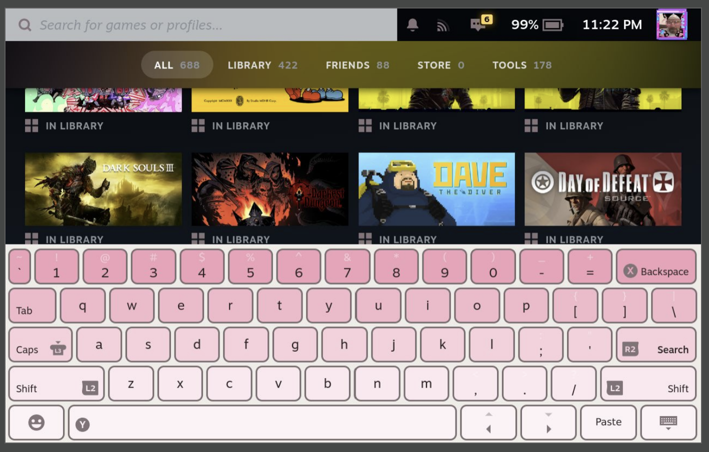

# 🌸 ⋆ ★ CSS Loader Pink Keyboard Theme ★ ⋆ 🌸

Pink keyboard for CSS Loader :3

---

## Features

- _Pink pastel palette_
- Rounded keycaps for a soft look
- 🌈 Different colors for each row
- 🎮 Works with [Decky Loader](https://github.com/SteamDeckHomebrew/decky-loader) + [CSS Loader](https://github.com/EMERALDGEEKS/css-loader)

---

## 📦 Installation

_Recommended_

Install directly from CSSLoader Store

_Manual Install_

1. Make sure you have [Decky Loader](https://github.com/SteamDeckHomebrew/decky-loader) and the **CSS Loader** plugin installed.
2. Download or clone this theme repo into your Steam Deck.
3. Move the theme folder to:
   ~/.local/share/decky-loader/plugins/CSSLoader/themes/

4. Open Decky → CSS Loader → Select **"Pink Keyboard Theme"**.

> You may need to restart Steam UI for changes to take effect.

---

## 🛠️ Customization

There is no customization yet, but I plan to add a slider for roundedness and an option to switch from gradient to solid.

---

## 🧸 License

MIT License.  
Feel free to remix, share, or use this theme in your own builds ✨

---

Made with 💖 by Isabeli Estefano
